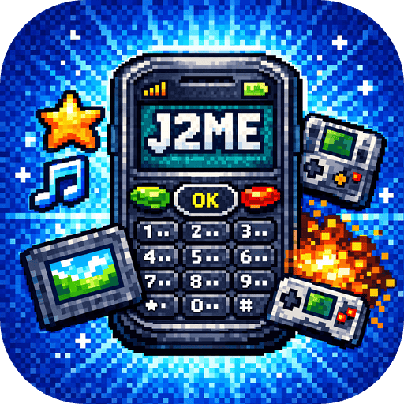

<p align="center">
    
</p>
<h1 align="center">JarBox</h1>

JarBox is a J2ME (Java ME) emulator for iOS that runs MIDP 2.0 / CLDC 1.1 games and applications on iPhone and iPad.

Built on top of [miniJVM](https://github.com/niclet/mini_jvm) (a lightweight JVM written in C) with the J2ME API layer ported from [J2ME-Loader](https://github.com/niclet/J2ME-Loader) (Android).

## AI-assisted development

This project was almost entirely built using [Claude Code](https://claude.ai/claude-code) as an experiment in applying LLMs to non-trivial codebases. The emulator involves C, Objective-C, Swift, Java, and OpenGL — spanning ~180k+ lines across multiple languages — and the vast majority of the code, debugging, and integration work was done through conversational interaction with Claude.

## Features

- **MIDlet lifecycle** — load and run J2ME apps from JAR files
- **2D rendering** — Canvas, Graphics, Image via Core Graphics (CGBitmapContext)
- **Game API** — GameCanvas, Sprite, TiledLayer, LayerManager
- **3D graphics** — MascotCapsule micro3D (OpenGL ES 2.0) and M3G JSR-184 (OpenGL ES 1.1)
- **Audio** — WAV/MP3 (AVAudioPlayer), MIDI (AVMIDIPlayer + SoundFont), ToneControl
- **Forms UI** — Form, List, Alert, TextBox rendered with native UIKit views
- **RMS** — RecordStore persistence via file system
- **Networking** — HTTP/HTTPS/Socket/UDP via miniJVM's built-in POSIX stack
- **Input** — virtual joystick (8-way) + numpad, touch → pointer events
- **OEM extensions** — Nokia, Siemens, Samsung, Motorola, Vodafone, KDDI, JBlend, SprintPCS, SonyEricsson
- **Per-game settings** — screen resolution, FPS limit, 3D supersampling (via long-tap menu)

## Architecture

```
┌─────────────────────────────────────────┐
│         iOS App (Swift / UIKit)         │
│   App list, game screen, virtual keys   │
├─────────────────────────────────────────┤
│        Native Bridge (C / Obj-C)        │
│  Rendering, audio, input, 3D (OpenGL)   │
├─────────────────────────────────────────┤
│       J2ME API (Java, j2me_api.jar)     │
│  MIDP/CLDC classes ported from          │
│  J2ME-Loader with iOS native calls      │
├─────────────────────────────────────────┤
│            miniJVM (C)                  │
│  Bytecode interpreter, GC, threading    │
└─────────────────────────────────────────┘
```

## Building

**Requirements:** macOS with Xcode 26+, JDK 17+ (for compiling Java sources)

1. Build the runtime JAR (one-time):
   ```bash
   cd miniJVM-2.0.0/binary && ./build_jar.sh
   ```

2. Build the J2ME API JAR:
   ```bash
   cd J2MEEmulator/j2me_api && ./build.sh
   ```

3. Open `J2MEEmulator/J2MEEmulator.xcodeproj` in Xcode, select a device or simulator, and run.

## Adding games

Place `.jar` files into the app's Documents directory (accessible via the Files app or Xcode device file transfer). The app scans for JARs on launch and displays them in a springboard-style grid.

## Per-game configuration

Long-press a game icon to access:
- **Screen Resolution** — 16 presets from 101x80 to 480x800
- **FPS Limit** — Unlimited, 15, 20, 30, 60 (default: 60)
- **3D Enhancement** — supersampled MascotCapsule / M3G rendering (3x)
- **Clear Game Data** / **Delete**

## License

[Apache License 2.0](LICENSE)

## Acknowledgments

- [J2ME-Loader](https://github.com/niclet/J2ME-Loader) — J2ME API implementation for Android
- [miniJVM](https://github.com/niclet/mini_jvm) — lightweight cross-platform JVM in C
- [gs_instruments.sf2](https://schristiancollins.com/generaluser.php) — General MIDI SoundFont for MIDI playback
